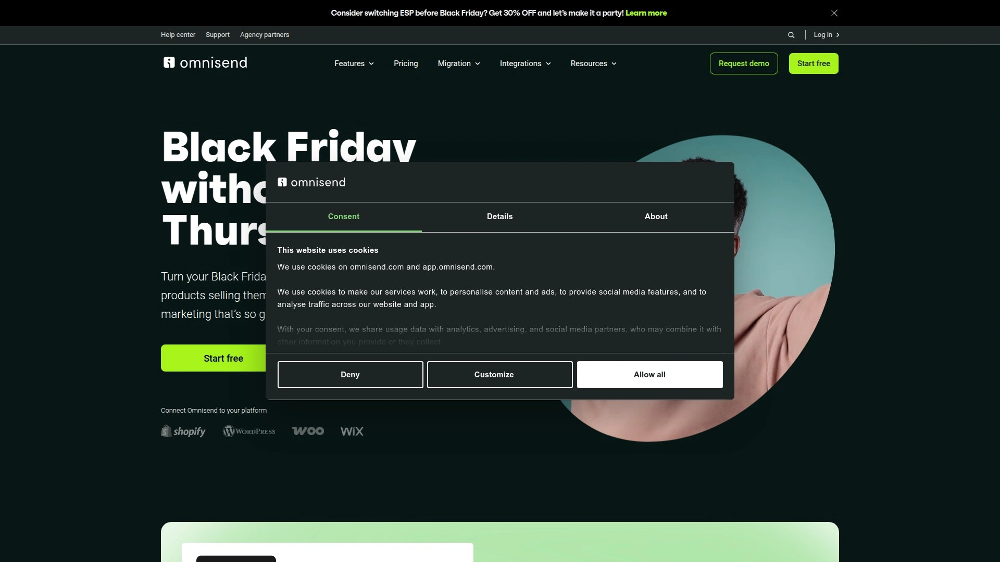

# Top 12 SMS Marketing Platforms for Ecommerce Brands in 2025 (Latest Update)

Ecommerce brands need immediate customer connection, and SMS marketing delivers exactly that. With open rates exceeding 98% and response times measured in minutes rather than hours, text messaging cuts through the noise where email often gets buried. The challenge isn't whether to adopt SMS marketing—it's choosing the right platform that balances automation power, compliance safeguards, and seamless integration with your existing Shopify or ecommerce stack.

This guide walks you through twelve proven SMS marketing platforms built specifically for online stores. Whether you're recovering abandoned carts, launching product drops, or building VIP customer relationships, these tools deliver the functionality and reliability your business demands without overwhelming complexity or hidden costs.

## **[Postscript](https://postscript.io)**

The SMS-first platform engineered specifically for Shopify merchants who treat text messaging as a primary revenue channel.

Postscript commits entirely to SMS marketing rather than splitting focus across multiple channels. This specialization translates into features like conversational AI agents that engage shoppers in real-time, automated cart recovery flows that feel personal rather than robotic, and an infinity testing system that replaces traditional A/B testing with AI-powered message optimization across hundreds of variants.

The platform shines brightest for brands experiencing cart abandonment challenges. Two-way conversation capabilities let customers ask questions directly via text, removing purchase friction at critical decision moments. Integration with Shopify runs deep—customer data, order history, and product catalogs sync automatically, enabling sophisticated segmentation without manual data wrangling.

Postscript's compliance infrastructure protects merchants from costly TCPA violations through built-in consent management and delivery monitoring. The platform maintains carrier relationships that ensure messages actually land in customer inboxes rather than vanishing into spam filters. Strategy support from dedicated SMS specialists helps brands map out campaigns that generate measurable returns, with customers typically reporting 34x ROI on properly executed flows.

Pricing operates on a pay-as-you-go model starting at minimum spend thresholds, with costs scaling based on message volume rather than contact list size. For Shopify stores serious about making SMS a top-three revenue driver, Postscript delivers the tools and expertise that justify the investment.

---

## **[Klaviyo](https://www.klaviyo.com)**

The data powerhouse that unifies SMS with email marketing through sophisticated automation and predictive analytics.

Klaviyo approaches SMS marketing as one component of a complete customer data ecosystem. Rather than operating SMS in isolation, the platform connects text messaging with email campaigns, website behavior tracking, and predictive purchase modeling powered by machine learning. This integration means a customer who abandons a cart might receive an email first, followed by an SMS reminder two hours later, then a final push notification—all triggered automatically based on engagement patterns.

The platform's strength lies in segmentation depth. Brands can target customers based on lifetime value predictions, browsing history, email engagement, past purchase categories, and dozens of other data points collected across channels. An apparel store could send SMS alerts about jacket restocks only to customers who previously viewed winter coats but didn't buy, while simultaneously texting a different segment about a flash sale on accessories.

Klaviyo's SMS features include MMS support for image-rich messages, two-way conversations for customer service integration, and automated flows that adapt based on recipient responses. AI-powered send time optimization ensures messages arrive when each individual customer is most likely to engage. Analytics dashboards provide clear attribution showing exactly which SMS messages drove revenue versus those that simply generated opens.

The platform suits ecommerce brands already invested in email marketing who want to layer SMS onto existing workflows without rebuilding their entire strategy. Pricing scales with contact count and message volume, with free tiers available for testing before committing to paid plans.

***

## **[Omnisend](https://www.omnisend.com)**

The omnichannel automation specialist that treats SMS, email, and push notifications as interconnected parts of a unified customer journey.

Omnisend builds campaigns around the concept that customers engage across multiple channels, and marketing should follow them wherever they are. The platform's visual workflow builder lets merchants create sequences where an abandoned cart triggers an email at hour one, an SMS at hour six, and a push notification at hour twelve—with logic branches that stop the sequence if the customer converts at any point.

Pre-built automation templates accelerate setup for common ecommerce scenarios: welcome series for new subscribers, order confirmation and shipping updates, browse abandonment recovery, back-in-stock alerts, and win-back campaigns for dormant customers. Each template includes SMS touchpoints alongside email, requiring minimal customization to launch.

The platform integrates natively with Shopify, WooCommerce, and BigCommerce, automatically syncing product catalogs and customer data. This integration enables dynamic content insertion—an SMS about abandoned items can include actual product names and images without manual data entry. Segmentation tools allow filtering by purchase history, on-site activity, email engagement, and SMS interaction patterns.

Omnisend operates on a pay-as-you-go SMS credit system layered on top of contact-based email pricing. Free plans exist for stores testing the platform, with paid tiers unlocking automation complexity and higher message volumes. The combination of affordable entry points and sophisticated multichannel capabilities makes Omnisend particularly appealing for growing ecommerce brands balancing budget constraints with automation needs.

***

## **[Attentive](https://www.attentive.com)**

The enterprise-grade messaging platform that pairs AI-driven personalization with white-glove strategic support for high-volume brands.

Attentive positions itself explicitly for mid-market to enterprise ecommerce companies treating SMS as a major revenue driver rather than an experimental channel. The platform's AI capabilities extend beyond basic personalization into predictive content selection, automatically choosing message variants and send times most likely to convert each individual subscriber.

List growth tools represent a significant differentiator. Attentive's sign-up units capture subscribers across desktop, mobile, email, Instagram, text-to-join, and in-store touchpoints, with a patent-pending two-tap system that collects emails while simultaneously growing SMS lists. Brands report subscriber acquisition rates double those of competing platforms.

The platform supports RCS messaging alongside traditional SMS, enabling rich media experiences with high-resolution images, video content, and interactive buttons directly within the message interface. This positions brands ahead of the curve as RCS adoption expands beyond Android into broader market penetration.

Attentive assigns dedicated strategy teams to each client, providing ongoing campaign optimization, seasonal planning, and performance analysis. This hands-on support explains the platform's appeal to brands with substantial messaging volumes but limited in-house SMS expertise. Compliance features include TCPA specialist review of programs, ADA-compliant sign-up units, and proactive deliverability monitoring.

Pricing reflects the enterprise positioning, with custom quotes based on list size and message volume rather than published rate cards. Brands spending significant sums on customer acquisition typically find the investment worthwhile when SMS channels generate 18-20% of total online revenue.

***

## **[Yotpo SMSBump](https://www.yotpo.com)**

The retention marketing hub that connects SMS with reviews, loyalty programs, and subscriptions through a single unified platform.

Yotpo takes an ecosystem approach, treating SMS as one component of a broader retention strategy that includes user-generated content, loyalty rewards, and subscription management. This integration creates unique opportunities—a brand can trigger an SMS requesting a product review two weeks after purchase, then automatically send a loyalty reward when the review is submitted, all within one workflow.

The platform offers advanced segmentation using RFM (Recency, Frequency, Monetary) analysis plus behavioral data from email, loyalty, and review interactions. An ecommerce store could identify high-value customers who engage with emails but haven't redeemed loyalty points, then send targeted SMS reminders about expiring rewards.

SMSBump supports two-way conversations and in-app chat integrations, enabling customer service teams to handle inquiries that start via SMS without switching platforms. Automation tools cover standard ecommerce scenarios like cart abandonment and shipping updates, with the added benefit of loyalty program integration—abandoned cart messages can include current point balances or special member discounts.

The platform pioneered RCS messaging in the ecommerce space, allowing brands to send visually rich messages that stand out in crowded inboxes. Analytics provide real-time insights into campaign performance with revenue attribution broken down by message type and audience segment.

Yotpo pricing operates on a pay-per-send model with no contact list limits, making it cost-effective for brands with large subscriber bases but moderate message volume. The unified retention platform approach works best for merchants already using or planning to implement Yotpo's reviews and loyalty products.

***

## **[TxtCart](https://txtcartapp.com)**

The AI-native cart recovery specialist that replaces human agents with conversational automation delivering eerily human-like interactions.

TxtCart focuses laser-sharp on abandoned cart recovery rather than trying to be an all-purpose SMS platform. The platform's AI agent engages customers in real-time two-way conversations, answering product questions, addressing concerns, and nudging toward purchase completion without any human involvement.

The conversational approach drives significantly higher recovery rates than one-way reminder blasts. When a customer texts back asking about sizing or shipping timeframes, TxtCart's AI responds immediately with relevant answers pulled from store data. These interactions feel personal rather than robotic, creating the impression of texting with a knowledgeable sales associate.

Integration with Shopify takes minutes, with one-click data syncing that pulls order history, product catalogs, and customer information automatically. The platform generates unique discount codes for each conversation, tracks revenue attribution in real-time, and provides detailed analytics on recovery rates and conversation patterns.

Transaction-based pricing sets TxtCart apart from competitors. Rather than paying per message sent, merchants pay a percentage of recovered sales—15% on the starter plan, dropping to 10% on growth tiers. This performance-based model aligns platform costs directly with results, eliminating risk for stores testing cart recovery SMS for the first time.

The AI-first architecture dramatically reduces customer support costs while maintaining 24/7 availability. Brands report cutting support expenses by 97% while simultaneously improving response times and conversion rates. For ecommerce stores with high cart abandonment and limited customer service resources, TxtCart offers a compelling value proposition focused on one thing done exceptionally well.

***

## **[Emotive](https://emotive.io)**

The conversational SMS pioneer now powering unified email and text marketing through its integration with Privy.

Emotive built its reputation on human-feeling conversations at scale, blending automation with live agent capabilities to create engagement that feels personal rather than mass-marketed. The platform's two-way messaging infrastructure supports both automated flows and real-time conversations, allowing brands to escalate complex inquiries to human representatives seamlessly.

Template library includes over 600 pre-tested SMS campaign structures covering abandoned carts, product launches, seasonal promotions, and customer win-back sequences. Rather than starting from blank slates, merchants can deploy proven message frameworks then customize based on brand voice and specific offers.

The platform emphasizes ROI guarantees, promising returns or refunding subscription costs—a confidence signal reflecting performance across thousands of ecommerce brands. Do-it-for-you services include dedicated strategists who design campaigns, write copy, and manage execution for merchants who want results without hands-on platform management.

Recent acquisition by Privy expands Emotive's capabilities into unified email and SMS marketing, allowing brands to manage both channels plus onsite popups from a single dashboard. This consolidation eliminates the friction of juggling multiple tools while maintaining the conversational SMS strengths that built Emotive's reputation.

Pricing includes 30-day free trials with no commitments, transitioning to monthly plans with integrated strategy support. The combination of conversational capabilities and white-glove service appeals to ecommerce brands who recognize SMS's revenue potential but lack internal expertise to execute effectively.

***

## **[Recart](https://recart.com)**

The fully-managed SMS platform engineering industry-leading opt-in rates through its OneClick subscription technology.

Recart's defining feature is OneClick, which allows returning visitors to join SMS lists with a single tap rather than typing phone numbers manually. The platform recognizes users who've previously subscribed to any Recart popup across its network, auto-filling their information and reducing friction to near-zero. This innovation drives opt-in rates averaging 20.1% versus 3.6% for traditional forms.

The managed service approach means every account receives a dedicated Customer Success Manager who strategizes, creates campaigns, and handles execution. Rather than learning platform mechanics, merchants brief their CSM on goals and offers, then approve campaigns before sending. This hands-off model appeals to time-constrained store owners who want SMS results without becoming SMS experts.

Lightweight popups load 400% faster than competitor solutions, ensuring mobile users on older devices actually see subscription offers before bouncing. Recart runs continuous tests across millions of impressions, building learnings into templates automatically rather than requiring individual brands to experiment.

Automation flows cover abandoned carts, welcome sequences, order updates, and reorder reminders, with AI tools that optimize content and send times based on subscriber behavior. Analytics provide click-only attribution and show costs in dollars before sending, eliminating credit-based pricing confusion that plagues many SMS platforms.

Pricing starts at minimal monthly fees with transparent per-message costs visible before campaigns launch. The combination of OneClick technology, managed services, and fast-loading popups positions Recart particularly well for brands prioritizing list growth speed and delegation over hands-on campaign control.

***

## **[SimpleTexting](https://simpletexting.com)**

The straightforward SMS platform that prioritizes ease of use and reliability over complex automation for small businesses needing simple solutions.

SimpleTexting lives up to its name by removing complexity barriers that intimidate businesses new to text marketing. The interface focuses on core functions—sending messages, managing contacts, handling replies—without overwhelming users with advanced features they don't need yet.

Mass texting capabilities let businesses broadcast messages to 500, 5,000, or 50,000 contacts with a few clicks. Two-way messaging enables real-time conversations, while scheduling tools allow planning campaigns in advance. Built-in link shortening and analytics track clicks without requiring third-party integration.

The platform includes saved reply templates that speed up response time for common questions, plus automated out-of-office messages that manage expectations when staff is unavailable. Contact management handles segmentation through tags and custom fields, allowing targeted messaging without complex query builders.

SimpleTexting integrates with popular tools via Zapier and native API connections, enabling event-based messaging triggers from CRM systems, email platforms, and scheduling software. This flexibility lets businesses layer SMS into existing workflows without replacing entire tech stacks.

Pricing operates on straightforward credit-based tiers starting at accessible monthly rates, with unused credits rolling over between billing periods. Free trials provide testing opportunities without credit card requirements. The combination of simplicity, reliability, and fair pricing makes SimpleTexting ideal for local businesses, service providers, and small ecommerce shops prioritizing function over sophistication.

***

## **[Sendlane](https://www.sendlane.com)**

The unified customer experience platform combining email, SMS, reviews, and forms through deep behavioral tracking and automation.

Sendlane treats SMS and email as interconnected channels within a broader customer experience strategy. The platform's Beacon tracking tool monitors website behavior, enabling automations triggered by specific page visits, product views, or cart additions. A customer browsing winter coats but not buying could automatically enter an SMS sequence three days later, while someone who abandoned a checkout receives immediate recovery texts.

The two-way reply center manages SMS conversations at scale, allowing customer service teams to respond to inquiries in real-time while automatically segmenting contacts based on responses. This proves particularly valuable for brands with extensive SKU catalogs where customers need product clarification before purchasing.

Sendlane's pricing model charges per email sent rather than per contact stored, creating cost advantages for brands with large subscriber lists but moderate send volumes. Deliverability receives consistent praise from users who report reliable inbox placement and strong carrier relationships.

The platform includes 50-plus pre-built automation templates covering welcome sequences, abandoned cart recovery, back-in-stock notifications, and win-back campaigns. Visual workflow builders enable complex multi-step journeys without technical skills, while real-time analytics track performance across both SMS and email channels simultaneously.

World-class support operates 24/7/365 with 30-second live chat response times, a significant differentiator when technical issues threaten time-sensitive campaigns. For ecommerce brands wanting unified email and SMS management with strong deliverability and responsive support, Sendlane offers compelling infrastructure backed by solid customer satisfaction ratings.

***

## **[Privy](https://www.privy.com)**

The complete customer journey platform merging email, SMS, and conversion-optimized popups into a unified growth engine for ecommerce.

Privy combines three essential ecommerce functions—list building, email marketing, and SMS campaigns—into one dashboard that eliminates tool-switching friction. The popup builder includes dozens of proven templates like exit-intent offers, spin-to-win wheels, and quiz funnels that capture both email addresses and phone numbers simultaneously.

Drag-and-drop campaign editors make designing emails and SMS messages straightforward even for non-designers, with ecommerce-focused templates that pull in products and discount codes automatically. Automation flows handle cart abandonment, welcome sequences, browse abandonment, and win-back campaigns, with visual builders that map customer journeys without code.

Real-time reporting shows exactly how each message performs across opens, clicks, and revenue attribution, enabling data-driven optimization of send times and content. Precision targeting uses behavioral data, purchase history, and engagement patterns to ensure messages reach the right segments at optimal moments.

Recent acquisition of Emotive enhances conversational SMS capabilities, adding 1:1 customer interactions and AI-powered personalization to Privy's existing automation strengths. This integration provides mid-market ecommerce brands with enterprise-level features without enterprise pricing complexity.

Transparent pricing starts at accessible monthly rates with no email sending limits or long-term contracts. The combination of popup expertise, email capabilities, and enhanced SMS functionality makes Privy particularly appealing for growing Shopify stores wanting comprehensive retention marketing without juggling multiple specialized tools.

***

## **[Textedly](https://www.textedly.com)**

The mass texting specialist delivering straightforward bulk SMS capabilities for organizations needing reliable high-volume messaging.

Textedly focuses on core bulk texting functionality without complex automation layers that increase costs and learning curves. The platform excels at sending mass messages to thousands of contacts with one-click execution, making it ideal for announcements, event promotions, emergency alerts, and time-sensitive notifications.

MMS support allows including images, attachments, and media in messages, enabling more engaging content than text-only SMS. The inbox solution enables two-way conversations, allowing recipients to respond and staff to reply individually despite messages originating as mass sends.

Text-to-join features simplify subscriber acquisition—customers text a keyword to a number to opt in automatically. Bulk contact upload handles thousands of numbers with single-button imports, while segmentation tools create targeted groups for more relevant messaging.

Automated campaigns schedule message sequences over any time period, keeping audiences engaged without manual intervention. Review request automation makes collecting customer feedback simple through SMS rather than email. Analytics dashboards provide real-time delivery confirmation and response tracking.

Pricing operates on accessible monthly tiers with pay-as-you-go options for occasional senders. Free accounts allow testing with initial message credits before committing to paid plans. The straightforward approach and reliability make Textedly suitable for churches, schools, service businesses, and ecommerce stores needing dependable mass texting without automation complexity.

***

## **[SlickText](https://www.slicktext.com)**

The customer engagement platform built around seamless two-way conversations and sophisticated automation workflows for targeted messaging.

SlickText emphasizes real-time two-way communication through its team inbox feature, allowing multiple representatives to manage customer conversations collaboratively. The inbox supports conversation assignment, internal comments, and seamless handoffs between team members—critical functionality for customer service-focused implementations.

Unlimited keywords set SlickText apart from competitors who charge extra for this feature. Keywords enable targeted list building where customers text specific words to join different lists—a retail store could use "SALE," "NEW," and "VIP" keywords to segment subscribers based on interests.

Advanced automation uses drag-and-drop workflow builders to create complex customer journeys based on behavior triggers and data points. Custom fields enrich contact profiles with store location preferences, purchase history, or VIP status, enabling highly personalized segmentation.

List growth tools include QR codes, branded popups, web forms, and tap-to-join social links that acquire subscribers across online and offline touchpoints. Visual analytics provide clear performance insights into campaign effectiveness, open rates, and conversion metrics.

Mobile apps for iOS and Android enable campaign management from anywhere, while unused message credits roll over between billing periods rather than expiring. The combination of robust inbox capabilities, unlimited keywords, and sophisticated automation makes SlickText particularly strong for businesses prioritizing customer engagement depth over simple broadcast messaging.

***

## Frequently Asked Questions

**Which SMS platform integrates best with Shopify stores?**

Postscript builds specifically for Shopify with native integration that syncs customer data, product catalogs, and order history automatically. The platform's SMS-first design means every feature connects directly to Shopify's ecommerce infrastructure without middleware or custom development.

**How do SMS marketing costs compare across these platforms?**

Pricing models vary significantly—some charge per contact stored, others per message sent, and a few use transaction-based models tied to recovered sales. SimpleTexting and Textedly offer straightforward credit-based pricing, while Klaviyo and Omnisend layer SMS costs onto email platform subscriptions. TxtCart's performance-based approach eliminates upfront risk by charging only when carts are recovered.

**Can these platforms handle international SMS messaging?**

Most platforms support international messaging with varying coverage. Omnisend supports all international country codes, while Klaviyo offers SMS in 20-plus countries. Check specific geographic requirements against each platform's coverage maps, as per-message costs and feature availability differ by region.

**What makes conversational SMS different from basic text blasts?**

Conversational platforms like TxtCart, Emotive, and Postscript enable real-time two-way interactions where customers can ask questions and receive relevant responses. This contrasts with one-way broadcast messages that simply announce offers without interaction capability. Conversational approaches drive higher engagement and conversion rates by removing purchase friction through dialogue.

**How quickly can businesses start seeing SMS marketing results?**

Basic automations like welcome texts and cart reminders often generate returns within days of activation. Most platforms provide quick-start templates that deploy rapidly with minimal configuration. However, sophisticated segmentation and optimization typically require 30-60 days of data collection before performance stabilizes at maximum efficiency levels.

***

## Conclusion

SMS marketing transforms how ecommerce brands connect with customers when implemented through platforms matching business goals and technical capabilities. The twelve solutions covered here span from specialized cart recovery tools to comprehensive omnichannel platforms, each solving specific challenges for different business models and growth stages.

For Shopify merchants prioritizing SMS as a primary revenue channel, **[Postscript](https://postscript.io)** delivers the specialization and sophistication that justifies its position as the industry standard. The platform's conversational AI, infinity testing, and deep Shopify integration create the infrastructure needed to generate substantial returns from text marketing rather than treating it as an afterthought channel. When cart abandonment threatens revenue and customer engagement demands immediate, personal connection, Postscript provides the tools and strategic support that convert SMS from experimental tactic into reliable profit driver.
